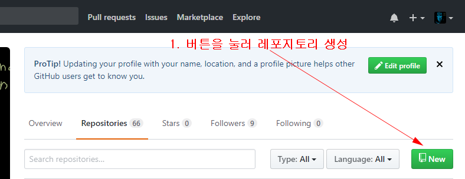
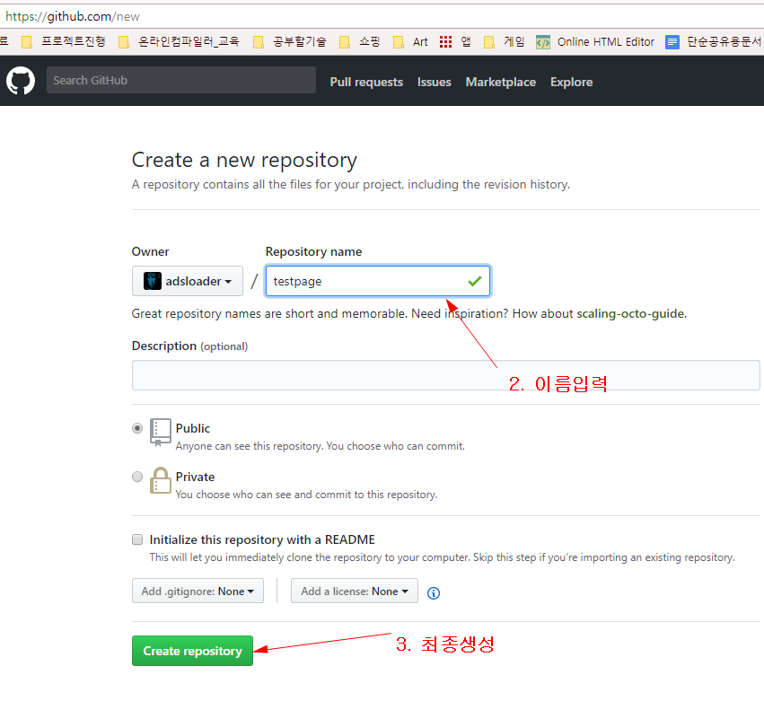
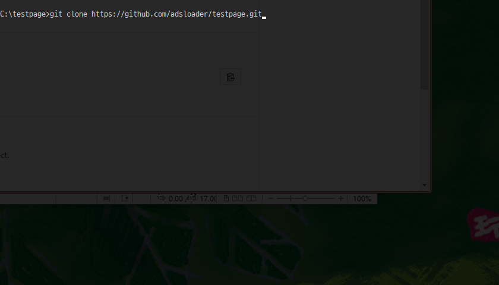
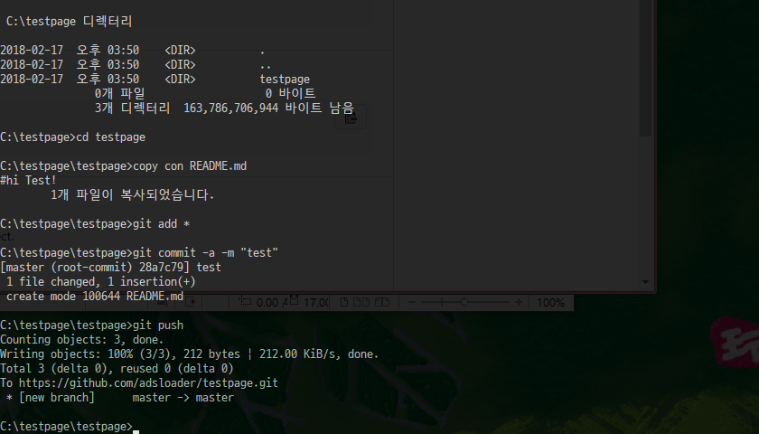
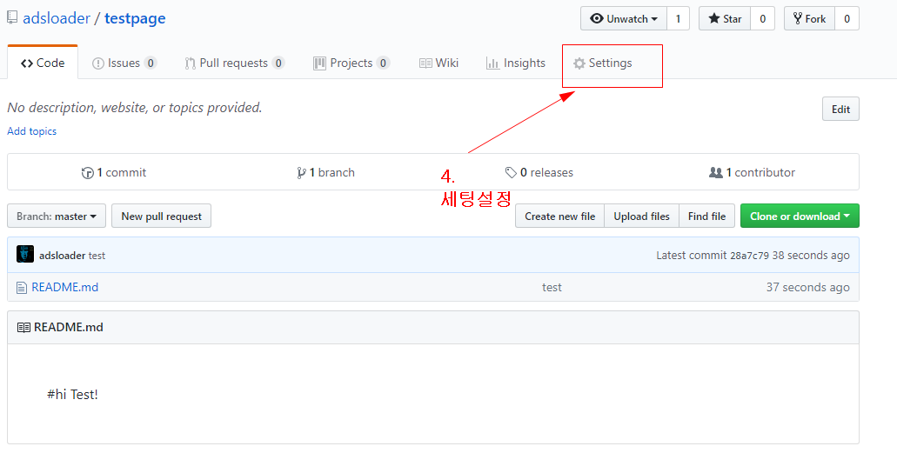
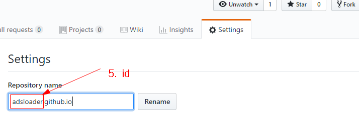
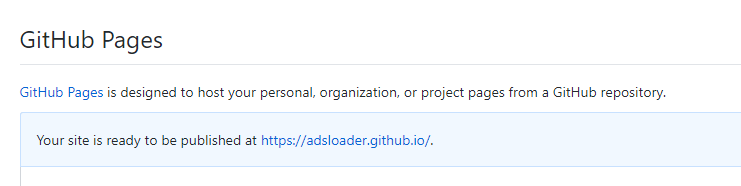

# 초간단 심플 github blog 만들기 

> github에서 blog를 만드는 방법은 다음과 같다. 
> 

1. github에서 레포지토리를 하나 만든다.

  

2. pc에서 clone한 후, README.md(메인페이지가될 것임)를 하나 만든다. 
3. git add * 
4. git commit -a -m "first"
5. git push

  

6. github에가서 해당 레포지토리로 이동한다. 
7. Settings를 누른다. 

  

8. repository name에 [아이디].github.io를 입력한다. **주의해야 할 것은 이미 지정되어 있으면 안된다.** 아이디 하나당 한개의 주소만 가능!

9. rename을 누른다. 그러면 다음과 같이 주소가 지정된다. 

  

10. 해당 주소로 Page를 만들어 사용할 수 있다. 
https://adsloader.github.io/
